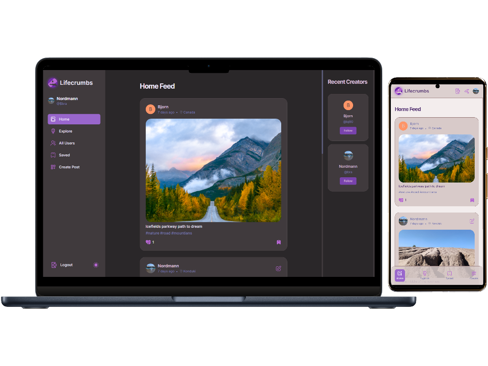

# LifeCrumbs (React + TypeScript + Appwrite + Vite)

#### Getting Started

To get started with this project, you will need to have Node.js and Vite installed on your machine.

To install Node.js, visit the Node.js website: [node](https://nodejs.org)

To install Vite, run the following command in your terminal:

```
npm install -g vite
```

Once you have Node.js and Vite installed, you can clone the lifecrumbs repository to your local machine:

```
git clone https://github.com/bakna2t/lifecrumbs.git
```

Navigate to the lifecrumbs directory and install the dependencies:

```
cd lifecrumbs
npm install
```

To start the development server, run the following command:

```
npm run dev
```

The development server will be running on http://localhost:5173. You can open this URL in your web browser to view the lifecrumbs app.

#### Developed with:

- [React](https://reactjs.org/)
- [TypeScript](https://www.typescriptlang.org/)
- [Vite](https://vitejs.dev/)
- [Appwrite](https://appwrite.io/)
- [Tailwind](https://tailwindcss.com/)
- [React Router](https://reactrouter.com/)
- [React Query](https://react-query.tanstack.com/) -[React Hook Form](https://react-hook-form.com/)
- [Shadcn-ui](https://ui.shadcn.com/)
- [Vercel](https://vercel.com/)
- [Zod](https://https://zod.dev/)

click here to visit => [_**Lifecrumbs**_](https://lifecrumbs-post.vercel.app/)

<div align="center">
    <p style="width: 500px;">
        <a href="https://lifecrumbs-post.vercel.app/" target="_blank" >
            
        </a>
    </p>
</div>
